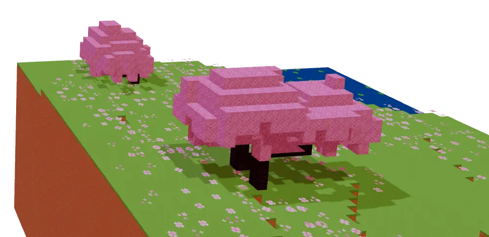

# **Hi, I'm Yash** 👋

## **🚀 Featured Projects**

### **🍔 ORDERKARO**  
*Mobile Food Delivery App*

A comprehensive app built using **Flutter** and **Supabase**, offering offline-first experience via **Hive**. Designed for speed, scalability, and seamless ordering.

**Highlights:**
- Offline data persistence  
- Real-time order tracking  
- Secure payment integration  
- Multi-restaurant support  

---

### **🌐 AWS DEHRADUN WEBSITE**  
*Community Platform*

Official community website built with **React** and **Vite**. Achieved high performance with optimized Lighthouse scores and responsive design.

**Highlights:**
- 95+ Lighthouse scores  
- Fully responsive layout  
- SEO and performance optimized  
- Community-focused features  

---

### **🏥 TECH ATRIOCARE WEBSITE**  
*Healthcare Technology Platform*

Led development during a **summer internship** using **Next.js**, with a focus on accessibility, UI/UX, and SEO. Contributed to a measurable improvement in user engagement.

**Highlights:**
- 25% increase in search visibility  
- UI/UX-driven development  
- Accessible and mobile-friendly  

---

## **🛠️ Tech Stack**

| **Frontend** | **Backend** | **Mobile** | **Database & Cloud** |
|--------------|-------------|------------|------------------------|
|           |        |     |        |

---

## **📊 GitHub Stats**

  
  

---

## **🤝 Let's Connect**

  
  
  

---

### **"Never stop creating."**

*Made with love and care by Yash*
